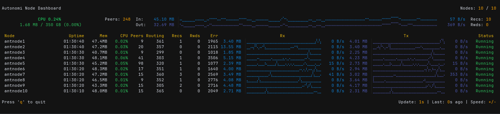

# autonomi_dash

<!-- Badges placeholder -->
[](https://github.com/<YOUR_GITHUB_USERNAME>/autonomi_dash/actions)
[](https://crates.io/crates/autonomi_dash)
[](https://opensource.org/licenses/MIT) <!-- Or Apache-2.0 -->

A terminal dashboard for monitoring Autonomi `antnode` instances.

<!-- i want a img here -->



## Features

*   **Automatic Discovery:** Finds running `antnode` instances by scanning log files (configurable path).
*   **Real-time Metrics:** Fetches and displays key metrics from discovered nodes.
*   **TUI Dashboard:** Presents information clearly in your terminal using `ratatui`.

## Installation

### Prerequisites

*   [Rust](https://www.rust-lang.org/tools/install) (stable toolchain)

### From Source

1.  Clone the repository:
    ```bash
    git clone https://github.com/champii/autonomi_dash.git # Replace with actual URL later
    cd autonomi_dash
    ```
2.  Build the release binary:
    ```bash
    cargo build --release
    ```
3.  The executable will be located at `target/release/autonomi_dash`.

### From Crates.io (Optional - Placeholder)

```bash
cargo install autonomi_dash
```
(Note: This will only work once the crate is published.)

## Usage

1.  Run the application:
    ```bash
    ./target/release/autonomi_dash
    ```
    Or, if installed via `cargo install`:
    ```bash
    autonomi_dash
    ```

2.  **Node Discovery:**
    *   By default, `autonomi_dash` looks for `antnode` log files in `~/.local/share/autonomi/node/*/logs/antnode.log` to find metrics server addresses.
    *   You can override this using the `--logs` option with a glob pattern:
      ```bash
      autonomi_dash --logs "/path/to/your/antnode/logs/**/*.log"
      ```

3.  **Keybindings:**
    *   `q`: Quit the application.


## Development

1.  **Setup:** Follow the "Installation from Source" steps.
2.  **Run in Debug Mode:**
    ```bash
    cargo run
    # Or with log pattern override
    cargo run -- --logs "/path/to/logs/*.log"
    ```
3.  **Run Tests:**
    ```bash
    cargo test
    ```
4.  **Linting & Formatting:**
    ```bash
    cargo fmt # Format code
    cargo clippy # Run linter
    ```

## License

This project is licensed under the MIT License. See the [LICENSE](LICENSE) file for details (or choose Apache-2.0).

It is recommended to add `license = "MIT OR Apache-2.0"` to your `Cargo.toml` file.
